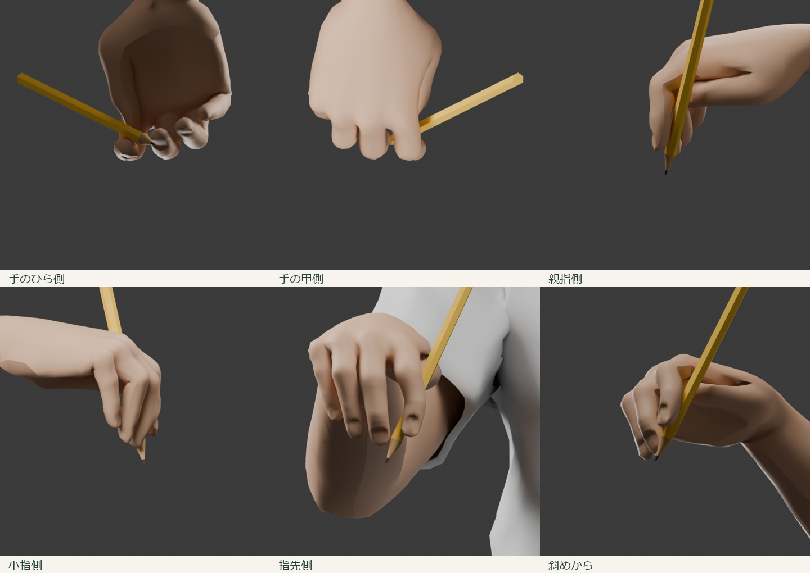

# 書字の鉛筆保持姿勢の修正（2026-09-30）

前回は指先の接近・非貫通のみを判定しており、書字姿勢として不適切だった。今回は写真・書写指導資料で、指先と軸の関係、近位人差し指の支え、親指との空間を確認して作り直した。

## 参照資料（正しい例と悪い例を区別）

- [トンボ鉛筆 ippo：正しい持ち方](https://tombow-ippo.jp/howto/)：先端方向の三指配置、親指側の側面、横60度・正面20度の写真。Point 1〜3の正しい例を使用。
- [日本筆記具工業会](https://www.jwima.org/pencil/07mochikata/07mochikata.html)：子どもの指先位置は先から約25mm、親指は人差し指より後ろ、中指は前、軸は人差し指に沿わせる。
- [文京区立駕籠町小学校の指導資料](https://www.bunkyo-tky.ed.jp/kagomachi-ps/index.cfm/1,76,c,html/76/20250213-154242.pdf)：PDF4ページの「鉛筆の正しい持ち方」の側面写真、5ページの指配置図・先端側の配置。
- [日本文教出版 LINE 8](https://www.nichibun-g.co.jp/library/line/line8.pdf)：PDF3ページ（紙面4–5）の緑枠の正しい持ち方図。**右上4枚の写真は悪い例なので採用しない**。人差し指の曲げすぎや親指との重なりの除外に使う。

他者の写真をモデルやサイトに転載していない。上記URLを参照する。異なる人の写真なので、多視点の厳密な三次元計測データとしては扱わない。

## 最終調整

親指は正しい例の写真を再確認し、付け根側を外へ開いてから鉛筆へ回り込む向きへ変更。人差し指は腹の接触位置を保ちながら指先だけを整え、軸に対する横ずれを約4.5mmから約0.56mmへ減らした。外へ開くこと・指先が戻ること・中心の整列を回帰検査に追加。

- 手全体の握り込みを増し、薬指と小指をまとめた。
- 接触の判定を「人差し指のどこか」から「腹の中央」へ変更。モデルの腹の中央にある皮膚頂点1734・1864の中点で検証する。
- 腹の中央が軸の上面に位置すること、腹が軸を向くことをそれぞれ確認。接触方向は上面方向と一致し、腹の向きの内積は約0.93。
- 親指を手前に寄せ、人差し指との皮膚間隔を約0.39mmに調整。両指の皮膚三角形の交差は0。軽く触れて見えるための微小隙間を残す。
- 鉛筆の水平面に対する傾斜は約54.5度、正面で外側20度。人差し指の腹・中指・親指に加え、人差し指の第二関節付近に軸を沿わせた。
- 実際に変形した全身32994三角形を、鉛筆の円柱包絡と検査。最小隙間約0.11mm、軸と三指の最小隙間は0.24〜0.43mm。骨の長さは保持する。
- 手のひら、甲、親指側、小指側、指先側、斜めの6方向で形を確認。参考写真は異なる人・撮影条件なので、厳密な三次元計測データや実写精度を保証するものではない。

1cmの指先表示と1mmの芯・別置きのものさしは同じ実寸スケール。25件の自動テストには、腹の中央・上面・向き・指同士の非交差・接近を含む。

